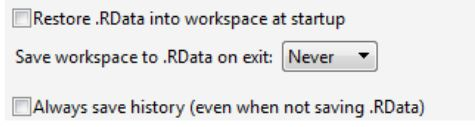
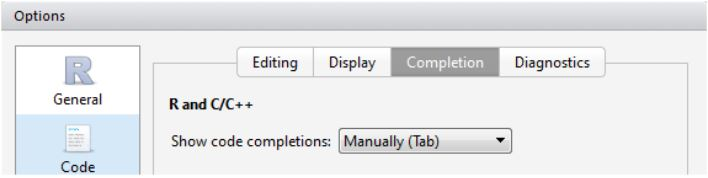

# Basics of R {#basics}

## Installing R and so on {#install}

If you are reading this at the HIE R course, the computers in this room already have **R** and RStudio installed. There is no need to update. Do take note of the recommended settings in RStudio discussed in Section \@ref(useinstall).

### R installation {#Rinstall}

Throughout this book, we assume you use RStudio. However, you still have to install **R**. RStudio is a program that runs **R** for us, and adds lots of functionality. You normally don't have to open the **R** program directly, just use RStudio (see next Section \@ref(useinstall)).

To install **R** on your system, go here : http://cran.r-project.org, click on the download link at the top and then 'base', and finally download the installer.

Run the installer, and simply press OK on all windows (since you will be using RStudio, the settings here don't matter).

It is a good idea to install newer versions of **R** when they become available. Simply repeat this process or see another solution in Section (not build).

### Using and Installing RStudio {#useinstall}

We will use RStudio throughout this course (but see note above, you need to install **R** first). To download RStudio, go here : www.rstudio.org to download it (Windows or Mac).

Take some time to familiarize yourself with RStudio. When you are using a new installation of RStudio, the default behaviour is to save all your objects to an ’RData’ file when you exit, and loads the same objects when you open RStudio. This is very dangerous behaviour, and you must turn it off. See Section (not built) for more information on ’RData’ files. For now, make sure you go to <span style="background-color: #eee; border-radius: 3px; border: 1px solid #b4b4b4; box-shadow: 0 1px 1px rgba(0, 0, 0, .2), 0 2px 0 0 rgba(255, 255, 255, .7) inset;  color: #333; display: inline-block; font-size: .85em; font-weight: 700; line-height: 1; padding: 2px 4px; white-space: nowrap;"> Tools </span> > <span style="background-color: #eee; border-radius: 3px; border: 1px solid #b4b4b4; box-shadow: 0 1px 1px rgba(0, 0, 0, .2), 0 2px 0 0 rgba(255, 255, 255, .7) inset;  color: #333; display: inline-block; font-size: .85em; font-weight: 700; line-height: 1; padding: 2px 4px; white-space: nowrap; markdown: 1;"> Global options... </span> and on the <span style="background-color: #eee; border-radius: 3px; border: 1px solid #b4b4b4; box-shadow: 0 1px 1px rgba(0, 0, 0, .2), 0 2px 0 0 rgba(255, 255, 255, .7) inset;  color: #333; display: inline-block; font-size: .85em; font-weight: 700; line-height: 1; padding: 2px 4px; white-space: nowrap; markdown: 1;"> General </span> tab, make sure the settings are like the figure below.

Another feature you may want to turn off is the automatic code completion, which is now a standard feature in RStudio. If you are using an older version of RStudio, this won’t apply (and you won’t be able to find the settings in the figure below).


<p align="center">
  
</p>

Figure 1.1: Settings in Tools/Global Options/General, to prevent automatically loading objects from a previous session. This contaminates your workspace, causing problems that are difficult to spot.

<p align="center">
  
</p>

Figure 1.2: Settings in <span style="background-color: #eee; border-radius: 3px; border: 1px solid #b4b4b4; box-shadow: 0 1px 1px rgba(0, 0, 0, .2), 0 2px 0 0 rgba(255, 255, 255, .7) inset;  color: #333; display: inline-block; font-size: .85em; font-weight: 700; line-height: 1; padding: 2px 4px; white-space: nowrap; markdown: 1;"> Tools </span> > <span style="background-color: #eee; border-radius: 3px; border: 1px solid #b4b4b4; box-shadow: 0 1px 1px rgba(0, 0, 0, .2), 0 2px 0 0 rgba(255, 255, 255, .7) inset;  color: #333; display: inline-block; font-size: .85em; font-weight: 700; line-height: 1; padding: 2px 4px; white-space: nowrap; markdown: 1;"> Global options </span> > <span style="background-color: #eee; border-radius: 3px; border: 1px solid #b4b4b4; box-shadow: 0 1px 1px rgba(0, 0, 0, .2), 0 2px 0 0 rgba(255, 255, 255, .7) inset;  color: #333; display: inline-block; font-size: .85em; font-weight: 700; line-height: 1; padding: 2px 4px; white-space: nowrap; markdown: 1;"> Code </span> > <span style="background-color: #eee; border-radius: 3px; border: 1px solid #b4b4b4; box-shadow: 0 1px 1px rgba(0, 0, 0, .2), 0 2px 0 0 rgba(255, 255, 255, .7) inset;  color: #333; display: inline-block; font-size: .85em; font-weight: 700; line-height: 1; padding: 2px 4px; white-space: nowrap; markdown: 1;"> Completion </span> to avoid automatic completion of your code, which opens hint windows as you type. Some people find this helpful, others find it annoying and distracting.

## Basic operations {#baseops}

### R is a calculator {#Rcalc}

When you open the **R** console, all you see is a friendly > staring at you. You can simply type code, hit <span style="background-color: #eee; border-radius: 3px; border: 1px solid #b4b4b4; box-shadow: 0 1px 1px rgba(0, 0, 0, .2), 0 2px 0 0 rgba(255, 255, 255, .7) inset;  color: #333; display: inline-block; font-size: .85em; font-weight: 700; line-height: 1; padding: 2px 4px; white-space: nowrap; markdown: 1;"> Enter </span>, and **R** will write output to the screen.

Throughout this tutorial, **R** code will be shown together with output in the following way:

```{r include=TRUE, collapse = TRUE}
# I want to add two numbers:
1 + 1
```

Here, we typed 1 + 1, hit <span style="background-color: #eee; border-radius: 3px; border: 1px solid #b4b4b4; box-shadow: 0 1px 1px rgba(0, 0, 0, .2), 0 2px 0 0 rgba(255, 255, 255, .7) inset;  color: #333; display: inline-block; font-size: .85em; font-weight: 700; line-height: 1; padding: 2px 4px; white-space: nowrap; markdown: 1;"> Enter </span>, and **R** produced 2. The [1] means that the result only has one element (the number ’2’).

In this book, the **R** output is shown after ##. Every example can be run by you, simply copy the section (use the text selection tool in Adobe reader), and paste it into the console (with <span style="background-color: #eee; border-radius: 3px; border: 1px solid #b4b4b4; box-shadow: 0 1px 1px rgba(0, 0, 0, .2), 0 2px 0 0 rgba(255, 255, 255, .7) inset;  color: #333; display: inline-block; font-size: .85em; font-weight: 700; line-height: 1; padding: 2px 4px; white-space: nowrap; markdown: 1;"> Ctrl </span> + <span style="background-color: #eee; border-radius: 3px; border: 1px solid #b4b4b4; box-shadow: 0 1px 1px rgba(0, 0, 0, .2), 0 2px 0 0 rgba(255, 255, 255, .7) inset;  color: #333; display: inline-block; font-size: .85em; font-weight: 700; line-height: 1; padding: 2px 4px; white-space: nowrap; markdown: 1;"> Enter </span> on a Windows machine, or <span style="background-color: #eee; border-radius: 3px; border: 1px solid #b4b4b4; box-shadow: 0 1px 1px rgba(0, 0, 0, .2), 0 2px 0 0 rgba(255, 255, 255, .7) inset;  color: #333; display: inline-block; font-size: .85em; font-weight: 700; line-height: 1; padding: 2px 4px; white-space: nowrap; markdown: 1;"> Cmd </span> + <span style="background-color: #eee; border-radius: 3px; border: 1px solid #b4b4b4; box-shadow: 0 1px 1px rgba(0, 0, 0, .2), 0 2px 0 0 rgba(255, 255, 255, .7) inset;  color: #333; display: inline-block; font-size: .85em; font-weight: 700; line-height: 1; padding: 2px 4px; white-space: nowrap; markdown: 1;"> Enter </span> on a Mac).

We can do all sorts of basic calculator operations. Consider the following examples:
```{r include=TRUE, collapse = TRUE}
# Arithmetic
12 * (10 + 1)

# Scientific notation
3.5E03 + 4E-01

# pi is a built-in constant
sin(pi/2)

# Absolute value
abs(-10)

# Yes, you can divide by zero
1001/0

# Square root
sqrt(225)

# Exponents
15^2

# Round down to nearest integer (and ceiling() for up or round() for closest)
floor(3.1415)
```

Try typing ?Math for description of more mathematical functions.
Also note the use of # for comments: anything after this symbol on the same line is not read by **R**. Throughout this book, comments are shown in green.

## Working with scripts and markdown files {#scriptmark}

When working with **R**, you can type everything into the console, just as you did in the last few examples. However, you’ve probably already noticed this has some disadvantages. It’s easy to make mistakes, and annoying to type everything over again to just correct one letter. It’s also easy to loose track of what you’ve written. As you move on to working on larger, more complicated projects (in other words, your own data!) you will quickly find that you need a better way to keep track of your analyses. (After all, have you ever opened up a spreadsheet full of data six months after you started it, and spent the whole day trying to reconstruct just what units you used in column D?)

Luckily **R** and RStudio provide a number of good ways to do this. In this course we will focus on two, scripts and markdown documents.

### R scripts {#scripts}

Scripts offer the simplest form of repeatable analysis in **R**. Scripts are just text files that contain code and comments. Script files should end in .R. 

In RStudio, open a new script using the File menu: <span style="background-color: #eee; border-radius: 3px; border: 1px solid #b4b4b4; box-shadow: 0 1px 1px rgba(0, 0, 0, .2), 0 2px 0 0 rgba(255, 255, 255, .7) inset;  color: #333; display: inline-block; font-size: .85em; font-weight: 700; line-height: 1; padding: 2px 4px; white-space: nowrap; markdown: 1;"> File </span> > <span style="background-color: #eee; border-radius: 3px; border: 1px solid #b4b4b4; box-shadow: 0 1px 1px rgba(0, 0, 0, .2), 0 2px 0 0 rgba(255, 255, 255, .7) inset;  color: #333; display: inline-block; font-size: .85em; font-weight: 700; line-height: 1; padding: 2px 4px; white-space: nowrap; markdown: 1;"> New File </span> > <span style="background-color: #eee; border-radius: 3px; border: 1px solid #b4b4b4; box-shadow: 0 1px 1px rgba(0, 0, 0, .2), 0 2px 0 0 rgba(255, 255, 255, .7) inset;  color: #333; display: inline-block; font-size: .85em; font-weight: 700; line-height: 1; padding: 2px 4px; white-space: nowrap; markdown: 1;"> R Script </span>, and save it in your current working directory with an appropriate name (for example, ‘rcourse_monday.R’). (Use <span style="background-color: #eee; border-radius: 3px; border: 1px solid #b4b4b4; box-shadow: 0 1px 1px rgba(0, 0, 0, .2), 0 2px 0 0 rgba(255, 255, 255, .7) inset;  color: #333; display: inline-block; font-size: .85em; font-weight: 700; line-height: 1; padding: 2px 4px; white-space: nowrap; markdown: 1;"> File </span> > <span style="background-color: #eee; border-radius: 3px; border: 1px solid #b4b4b4; box-shadow: 0 1px 1px rgba(0, 0, 0, .2), 0 2px 0 0 rgba(255, 255, 255, .7) inset;  color: #333; display: inline-block; font-size: .85em; font-weight: 700; line-height: 1; padding: 2px 4px; white-space: nowrap; markdown: 1;"> Save </span>, note that your working directory is the default location).

A brand new script is completely empty. It’s a good idea to start out a new script by writing a few comments:
```{r include=TRUE, eval = FALSE}
# HIE R Course - Monday
# Notes by <your name here>
# <today's date>
# So far we've learned that R is a big calculator!
1 + 1
```

As we mentioned in Section \@ref(Rcalc), the # symbol indicates a comment. On each line, **R** does not evaluate anything that comes after #. Comments are great for organizing your code, and essential for reminding yourself just what it was you were intending. If you collaborate with colleagues (or your supervisor), you’ll also be very grateful when you see comments in their code – it helps you understand what they are doing.

<div style="background-color: honeydew;border: 1px solid #000000; padding: 4px 4px; white-space: normal; markdown: 1;">**Try this yourself** 
Sometimes, you might want to write code directly into the console, and add it to a script later, once it actually works as expected. You can use the <span style="background-color: #eee; border-radius: 3px; border: 1px solid #b4b4b4; box-shadow: 0 1px 1px rgba(0, 0, 0, .2), 0 2px 0 0 rgba(255, 255, 255, .7) inset;  color: #333; display: inline-block; font-size: .85em; font-weight: 700; line-height: 1; padding: 2px 4px; white-space: nowrap; markdown: 1;"> History </span> tab in RStudio to save some time. There, you can select one or more lines, and the button <span style="background-color: #eee; border-radius: 3px; border: 1px solid #b4b4b4; box-shadow: 0 1px 1px rgba(0, 0, 0, .2), 0 2px 0 0 rgba(255, 255, 255, .7) inset;  color: #333; display: inline-block; font-size: .85em; font-weight: 700; line-height: 1; padding: 2px 4px; white-space: nowrap; markdown: 1;"> To Source </span> will copy it to your script.
<br>Try it now. Select one line by clicking on it, and send it to your script file using To Source.
<br>You can use this feature to add all of the examples we typed in Section \@ref(Rcalc) to your notes. To select more than one line at a time, hold down <span style="background-color: #eee; border-radius: 3px; border: 1px solid #b4b4b4; box-shadow: 0 1px 1px rgba(0, 0, 0, .2), 0 2px 0 0 rgba(255, 255, 255, .7) inset;  color: #333; display: inline-block; font-size: .85em; font-weight: 700; line-height: 1; padding: 2px 4px; white-space: nowrap; markdown: 1;"> Shift </span>. You can then send all the examples to your new script file with one click. </div>
